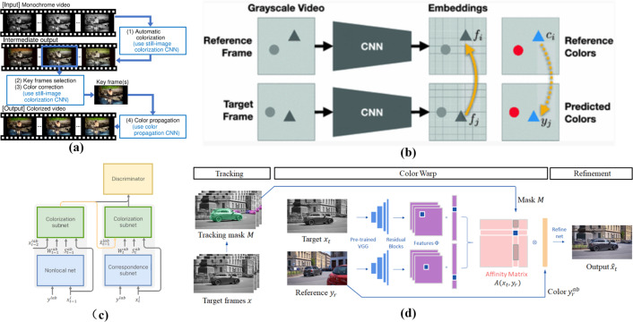
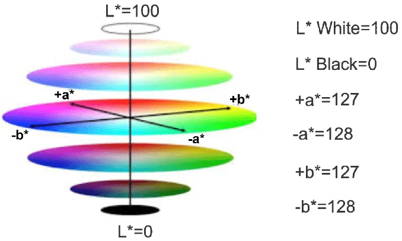
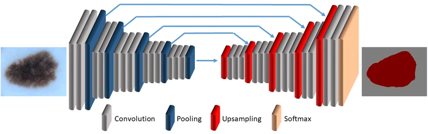

🎨 Image Colorization using Deep Learning

A dual-model image colorization system that converts black & white images into realistic color images using deep learning.

This project demonstrates both:

- 🧠 A custom-trained model (built from scratch)
- 🎯 A state-of-the-art pretrained model (Zhang et al., ECCV 2016)

---

🚀 Live Demo

👉 Deployable via Streamlit Cloud
(First run may take a few seconds to download the pretrained model)

---

✨ Features

- 🔄 Dual Model System
    - Local trained model (fast, lightweight)
    - Pretrained model (high-quality results)

- 🆚 Comparison Mode
    - View Original vs Local vs Pretrained side-by-side

- 🎨 Color Boosting
    - Enhances saturation for better visual output in local model

- 📥 Smart Model Handling
    - Pretrained model is downloaded automatically at runtime
    - Avoids GitHub file size limits

- 📱 Mobile Friendly UI
    - Optimized layout for all screen sizes

---

🧠 Models Used

🔹 Local Model (Custom Trained)

- Trained on Oxford-IIIT dataset
- Input: Grayscale (L channel)
- Output: Color channels (AB)
- Architecture: CNN
- Loss: MAE
- Activation: Tanh (full color range)

«Built to demonstrate deep learning pipeline under limited hardware constraints»

---

🔹 Pretrained Model

Based on:

"Colorful Image Colorization" — Zhang et al. (ECCV 2016)

- Trained on large-scale datasets
- Implemented using OpenCV DNN (Caffe)
- Produces high-quality realistic results

---

⚙️ Pretrained Model Handling

Due to GitHub’s 100MB file size limit, the pretrained model is not stored in the repository.

Instead:

- 📥 It is automatically downloaded at runtime
- ⚡ Cached after first use
- 🚀 Ensures smooth deployment on Streamlit Cloud

---

🧪 How It Works

1. Convert image → LAB color space
2. Extract L channel (grayscale)
3. Predict AB channels using model
4. Merge L + AB
5. Convert back to RGB

---

🖼️ Visuals

🔹 Pipeline



🔹 LAB Color Space



🔹 Network Architecture



---

📁 Project Structure

```bash
Image-Colorization/
│
├── app.py
├── colorize.py
├── requirements.txt
│
├── models/
│ ├── local-trained/
│ │ └── colorization_model.keras
│ │
│ ├── pre-trained/ # auto-downloaded at runtime
│ │
│ └── model_training/
│ ├── core_model.ipynb
│ ├── colorization_training.ipynb
│ └── colorization_example.ipynb
│
├── assets/
└── README.md
```

---

▶️ Run Locally

```bash
git clone https://github.com/your-username/Image-Colorization.git
```

```bash
cd Image-Colorization
```

```bash
python -m venv venv
source venv/bin/activate
```

```bash
pip install -r requirements.txt
```

```bash
streamlit run app.py
```

---

⚠️ Limitations

- Local model is less accurate than pretrained
- Colorization is inherently ambiguous
- Results depend on image context

---

📚 References

- Zhang, R., Isola, P., & Efros, A. A. (2016).
  Colorful Image Colorization

- OpenCV DNN Module

- TensorFlow / Keras

---
