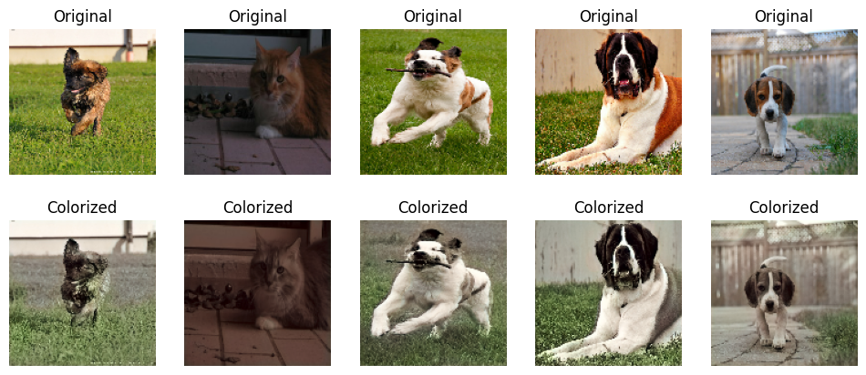

# 🎨 Image Colorization using Deep Learning

Automatic image colorization using a **U-Net based deep neural network** trained to convert grayscale images into realistic color images.

This project allows users to **colorize black & white photos instantly** using a pretrained model — no training required.

Users can simply clone the repository and run:

```
python colorize.py image.jpg
```

The model will automatically generate a colorized version of the image.

---

# 📸 Example

| Original                 | Colorized                |
| ------------------------ | ------------------------ |
|  |  |

*(Example output from the trained model)*

---

# 🧠 How It Works

The model uses **deep learning based image-to-image translation** to predict color information from grayscale images.

The pipeline follows a widely used **LAB colorization approach**.

### Colorization Pipeline

```
Input Image
↓
Convert RGB → LAB
↓
Extract L channel (grayscale)
↓
Predict AB color channels using neural network
↓
Combine L + AB
↓
Convert LAB → RGB
↓
Colorized Image
```

### Why LAB Color Space?

LAB separates brightness and color:

| Channel | Meaning                           |
| ------- | --------------------------------- |
| **L**   | Lightness (grayscale information) |
| **A**   | Green ↔ Red color component       |
| **B**   | Blue ↔ Yellow color component     |

Instead of predicting all RGB values, the network only predicts **A and B color channels**, making training easier and improving stability.

---

# 🧩 Model Architecture

The model uses a **U-Net convolutional neural network**.

U-Net is widely used in:

* image segmentation
* medical imaging
* image restoration
* colorization

### Why U-Net?

U-Net uses **skip connections** that preserve spatial information.

```
Encoder
↓
Feature extraction
↓
Decoder
↓
Color reconstruction
```

Architecture overview:

```
Input (128x128 grayscale)

Encoder
↓
Conv → Conv → Pool
↓
Conv → Conv → Pool
↓
Bottleneck

Decoder
↓
Upsample → Concatenate
↓
Conv → Conv
↓
Upsample → Concatenate
↓
Conv → Conv

Output (128x128 AB color channels)
```

Advantages:

* preserves image structure
* produces smoother colors
* relatively lightweight model

---

# 📊 Dataset Used

Training was performed using the **Oxford-IIIT Pet Dataset**.

This dataset contains thousands of high-resolution images of cats and dogs and is commonly used for computer vision research.

Dataset properties:

| Feature    | Value           |
| ---------- | --------------- |
| Images     | ~7,000          |
| Resolution | High resolution |
| Classes    | 37 pet breeds   |

Images were resized to:

```
128 × 128
```

for training.

---

# ⚙️ Training Details

| Parameter       | Value              |
| --------------- | ------------------ |
| Model           | U-Net              |
| Input size      | 128×128            |
| Color space     | LAB                |
| Loss function   | Mean Squared Error |
| Optimizer       | Adam               |
| Training device | GPU                |
| Framework       | TensorFlow / Keras |

Training was performed on a GPU using **Google Colab**.

---

# 📦 Pretrained Model

The repository includes a pretrained model:

```
colorization_model.keras
```

Model characteristics:

| Property     | Value             |
| ------------ | ----------------- |
| Architecture | U-Net             |
| Input        | 128×128 grayscale |
| Output       | AB color channels |
| File size    | ~12-18 MB         |

The model is intentionally kept small so it can be **stored directly in the repository** and downloaded quickly.

Users **do not need to train the model themselves**.

---

# 🚀 Installation

Clone the repository:

```
git clone https://github.com/grvsnh/Image-Colorization
cd Image-Colorization
```

Create a virtual environment (recommended):

```
python -m venv venv
source venv/bin/activate
```

Install dependencies:

```
pip install -r requirements.txt
```

---

# ▶️ Usage

Run the colorization script:

```
python colorize.py path_to_image
```

Example:

```
python colorize.py images/bw_portrait.jpg
```

Output will be saved to:

```
colorized_images/
```

Example result:

```
colorized_images/colorized_bw_portrait.jpg
```

---

# 🖼 Included Test Images

The repository contains sample grayscale images in:

```
images/
```

Example files:

```
bw_portrait.jpg
bw_landscape.jpg
bw_street.jpg
bw_car.jpg
```

You can test the model immediately:

```
python colorize.py images/bw_landscape.jpg
```

---

# 📁 Project Structure

```
Image-Colorization
│
├── colorize.py                # Main inference script
├── colorization_model.keras   # Pretrained model
│
├── images/                    # Sample grayscale images
│   ├── demo.png
│   ├── bw_portrait.jpg
│   ├── bw_landscape.jpg
│   ├── bw_street.jpg
│   └── bw_car.jpg
│
├── README.md
├── LICENSE
├── requirements.txt
└── .gitignore
```

Generated images are saved in:

```
colorized_images/
```

(This folder is ignored by Git.)

---

# 🌐 Future Improvements

Planned improvements include:

* Streamlit web application for live colorization
* support for higher resolution images
* perceptual loss for better color realism
* training on larger datasets
* automatic batch colorization

---

# 🧪 Technologies Used

* Python
* TensorFlow
* Keras
* OpenCV
* NumPy
* Matplotlib

---

# 📜 License

This project is licensed under the MIT License.

See the LICENSE file for details.

---

# 👨‍💻 Author

Developed by **grvsnh**

This project explores deep learning techniques for **automatic grayscale image colorization** and demonstrates how lightweight neural networks can produce realistic color predictions.

